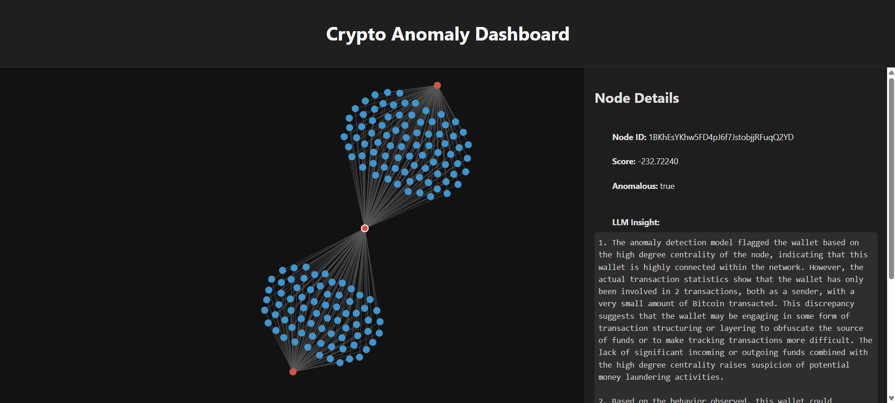

# Graph-Based Fraud Detection for Cryptocurrency with Explainable AI (XAI)

This project explores the application of graph-based anomaly detection and explainable AI (XAI) tools to detect and interpret fraudulent activities in cryptocurrency transactions. By leveraging the structure of blockchain data as a graph and integrating machine learning techniques, this project aims to address a critical gap in cryptocurrency fraud detection and policy enforcement.

This project reflects the work described in the paper found [here](https://arxiv.org/abs/2506.14933). 

## Problem Statement
The decentralized nature of cryptocurrency, while celebrated for its innovation, has also introduced significant challenges in detecting and addressing fraud. Traditional data analytics methods often fall short when applied to blockchain's inherently graphical structure. Meanwhile, fraudulent activities—often involving obscure tokens and low-volume transactions—remain difficult to identify, leaving regulators with limited actionable insights.

## Project Objectives
- Develop a graph-based anomaly detection model to identify fraudulent behavior in cryptocurrency transactions.
- Integrate GraphLIME, a graph-specific XAI tool, to explain and visualize model predictions.
- Map XAI outputs to actionable policy recommendations for enhanced regulatory enforcement.

## Dataset
This project utilizes the [Elliptic++ Actors Dataset](https://github.com/git-disl/EllipticPlusPlus/tree/main), a comprehensive collection of blockchain transaction data formatted as graphs. The dataset includes:
- **wallets_features.csv**: Feature data for actors.
- **wallets_classes.csv**: Class labels for actors.
- **AddrAddr_edgelist.csv**: Address-to-address graph edgelist.
- **AddrTx_edgelist.csv**: Address-to-transaction graph edgelist.
- **TxAddr_edgelist.csv**: Transaction-to-address graph edgelist.

For dataset details and download instructions, refer to the [data_sources.md](data/data_sources.md) file.


## Repository Structure
```
├── dashboard/                 # Resources to run the project dashboard
│   ├── dashboard_data/        # Data needed to build the dashboard
│   ├── screenshots/           # Samples of the final dashboard
│   ├── ui/                    # Files for creating the dashboard ui
│   ├── dashboard_setup.py     # Populates dashbaord_data files
├── data/                      # Dataset and related files
│   ├── raw/                   # Raw dataset files
│   ├── processed/             # Preprocessed data
│   ├── data_sources.md        # Dataset overview and instructions
├── features/                  # Contains anomaly, node, and edge features afer running main.py
├── src/                       # Source code for preprocessing, models, and utilities
├── tests/                     # Files for looking over data
├── main.py/                   # Runs the main program to generate features and explain 1 anomaly
├── generate_all_insights.py/  # Generates a set number of llm insights
├── README.md                  # This document!
├── requirements.txt           # Required Python packages
```

## Getting Started
1. Clone this repository:
   ```bash
   git clone https://github.com/awatson246/crypto-anomaly-detection-policy.git
   cd crypto-fraud-detection
   ```
2. Install dependencies:
   ```bash
   pip install -r requirements.txt
   ```
3. Download the dataset as per the [data_sources.md](data/data_sources.md) instructions and place it in the `data/raw/ellipticplusplus/actors/` directory.
4. Setup your OpenAI key by creating a .env file in the root of the repo, and adding your key:
   ```bash
   OPENAI_API_KEY=your-api-key-here
   ```
5. To generate features, run:
   ```bash
   python main.py
   ```
6. Then, to generate llm insights run:
   ```bash
   python generate_all_insights.py
   ```
7. Finally, for the dashboard run:
   ```bash
   python dashboard/dashboard_setup.py
   ```
   which will create the neccesary files in the dashboard/data folder. 
8. To launch the dahboard, run: 
   ```bash
   python -m http.server
   ```
   and navigate to http://localhost:8000 to view the dashboard. 
   It should look somethikg like this: 
   

## Contributing
Contributions are welcome! Please open an issue or submit a pull request if you have suggestions or improvements.

## License
This project is licensed under the MIT License.

## References
Youssef Elmougy and Ling Liu. 2023. Demystifying Fraudulent Transactions and Illicit Nodes in the Bitcoin Network for Financial Forensics. In Proceedings of the 29th ACM SIGKDD Conference on Knowledge Discovery and Data Mining (KDD ’23), August 6–10, 2023, Long Beach, CA, USA. ACM, New York, NY, USA, 12 pages. https://doi.org/10.1145/3580305.3599803

---

For any questions, please contact [Adriana Watson](mailto:watso213@purdue.edu).

